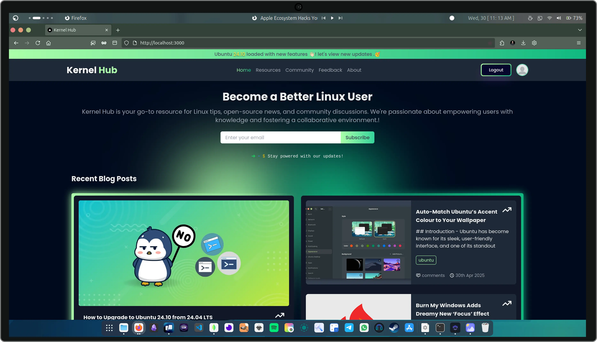

<div align="center">
   <picture>
      
   </picture>
   <h2>Kernel Hub</h2>
</div>
<div align="center">


| Linux & Open-Source Ecosystem Blog Platform fullstack web app |
|-----------------------------------------|
</div>

**Kernel Hub** is a full-stack blog application designed for sharing **news, updates, tutorials, and articles** about Linux, open-source software, community events, and the broader Linux ecosystem. Built on the **MERN stack** and fully **Dockerized**, it provides a scalable, production-ready platform for content publishing and community-driven knowledge sharing.

> Kernel Hub is a modern digital platform for the Linux and open-source community.

---
## 📸 Screenshot Previews

<div align="center">
  
</div>

> *Preview image showing the kernelhub interface.*

---


## 🚀 Overview

Kernel Hub provides a complete blogging and publishing ecosystem with:

* Secure authentication
* Dynamic content management
* Markdown-based publishing
* Image handling
* Scalable architecture
* Containerized deployment

It is designed for **performance, maintainability, and scalability**, making it suitable for both community platforms and production deployments.

---

## ✨ Core Features

* 🔐 **User Authentication**
  Secure login and registration using bcryptjs and JSON Web Tokens (JWT)

* 📱 **Responsive UI**
  Fully responsive interface built with Tailwind CSS and typography plugin

* 🐳 **Dockerized Architecture**
  Docker Compose for easy setup, deployment, and environment consistency

* 📝 **Markdown Support**
  Write posts in markdown with rich rendering and syntax highlighting

* 🖼 **Image Handling**
  Image upload, optimization, and delivery using Multer and Cloudinary

* 🔄 **Dynamic Content Management**
  Create, update, and manage Linux-related articles and news

* ⚡ **High Performance**
  Optimized frontend and backend architecture

---

## 🧠 Architecture

```text
[ Next.js Frontend ]
        │
        │  (REST APIs / Axios)
        │
[ Node.js + Express Backend ]
        │
        │  (JWT Auth + API Layer)
        │
[ MongoDB Database ]
        │
        │
[ Cloudinary Media Storage ]
        │
        │
[ Docker + Docker Compose ]
```

---

## 🛠️ Tech Stack

### Frontend

* Next.js
* React
* Tailwind CSS
* Tailwind Typography Plugin
* Framer Motion
* Axios
* React Markdown
* React Icons

### Backend

* Node.js
* Express.js
* MongoDB
* Mongoose
* JSON Web Tokens (JWT)
* bcryptjs
* Multer
* Cloudinary

### Database

* MongoDB

### Containerization

* Docker
* Docker Compose

---

## 📦 Backend Dependencies

* `bcryptjs` – Password hashing
* `cloudinary` – Image storage and management
* `cors` – Cross-Origin Resource Sharing
* `dotenv` – Environment variable management
* `ejs` – Template engine (optional server-side rendering)
* `express` – Backend framework
* `jsonwebtoken` – Authentication token handling
* `mongoose` – MongoDB object modeling
* `multer` – File upload handling
* `nodemon` – Development auto-reload

---

## 🎨 Frontend Dependencies

* `@tailwindcss/typography` – Enhanced typography
* `autoprefixer` – Vendor prefixing
* `axios` – HTTP client
* `clsx` – Conditional class names
* `css-loader` – CSS handling
* `framer-motion` – Animations
* `moment` – Date formatting
* `next` – React framework
* `react`, `react-dom` – Core libraries
* `react-icons` – Icon library
* `react-markdown` – Markdown rendering
* `react-syntax-highlighter` – Code highlighting
* `rehype-highlight` – Syntax highlighting
* `remark-gfm` – GitHub-flavored markdown
* `sharp` – Image processing
* `tailwind-merge` – Tailwind utility merging

---

## 🔧 Platform Capabilities

* Secure authentication system
* Role-based access control (extendable)
* Markdown-based publishing
* Image upload & CDN delivery
* SEO-friendly rendering
* Content versioning
* API-driven architecture
* Scalable microservice-ready structure
* Containerized deployment

---

## 📦 Installation

### Prerequisites

* [Docker](https://www.docker.com/get-started) and Docker Compose
  **OR**
* Node.js (for local development without Docker)

---

### Docker Setup (Recommended)

```bash
# Clone repository
git clone <repo-link>
cd kernel-hub

# Start services
docker-compose up -d
```

---

### Local Development (Without Docker)

```bash
# Backend
cd server
npm install
npm run dev

# Frontend
cd client
npm install
npm run dev
```

---

## ▶️ Usage Flow

1. User registers / logs in
2. JWT authentication is established
3. User creates or edits content
4. Markdown is rendered on frontend
5. Images are uploaded to Cloudinary
6. Content is delivered dynamically

---

## 🎯 Project Positioning

Kernel Hub functions as:

* 📰 **Linux News Platform**
* 🌐 **Open-Source Knowledge Hub**
* 🧠 **Community Publishing System**
* 🧩 **Content Management Platform**
* 🚀 **Scalable Blog Infrastructure**

---

## 🤝 Contributing

1. Fork the repository
2. Create a branch

   ```bash
   git checkout -b feature-name
   ```
3. Commit changes

   ```bash
   git commit -m "Add feature"
   ```
4. Push branch

   ```bash
   git push origin feature-name
   ```
5. Open Pull Request

---

## 📄 License

MIT License

---


> Kernel Hub is a modern, scalable platform for the Linux and open-source community — built for performance, security, and growth.
